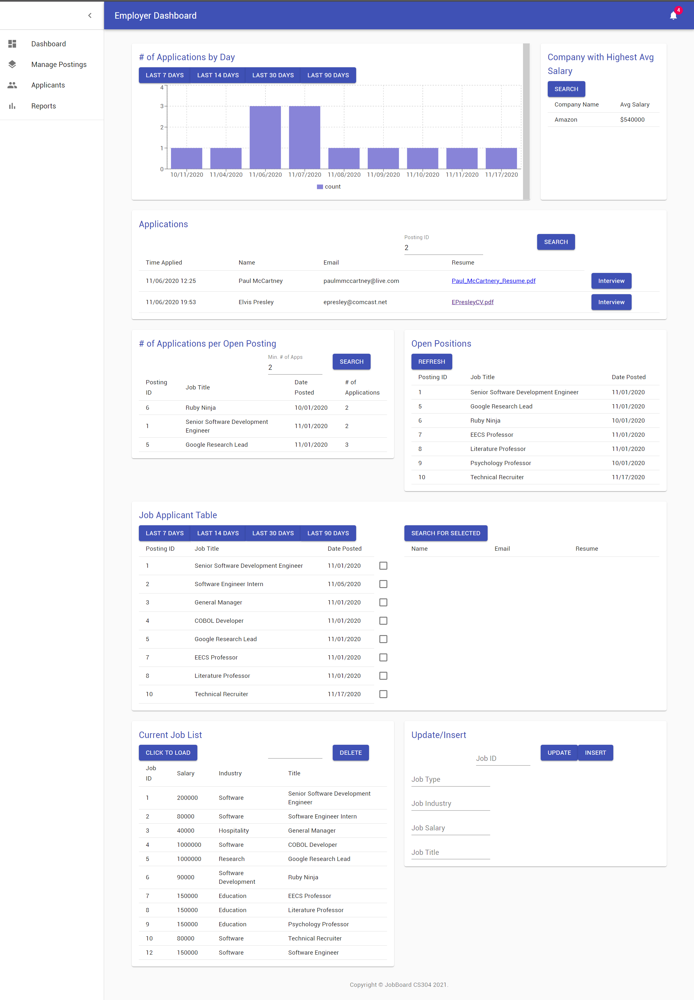

# JobBoard
Job Board Project for CPSC 304 (Group 17)

## Tech Stack
We used ReactJS, NodeJS, ExpressJS and MySQL for this project. ReactJS was used to create the frontend UI components. Node was used as to interface with our MySQL database. While ExpressJS was used to create API endpoints to fetch the data from the backend to the frontend UI components.

### How to Install and Run
All the dependencies need to be installed via npm.

List of dependencies (might not have everything):
- react
- react-dom
- @material-ui/core
- @material-ui/icons
- mysql
- express
- dotenv

#### Steps
1. Create a local MySQL database.
2. Create a `.env` file in this project's root folder and fill out the DB_HOST, DB_USER and DB_PASS fields. Example below:
    `DB_HOST=localhost
    DB_USER=root
    DB_PASS=password`
3. Run the `init.sql` file in the database.
4. Run the `update-password.sql` file in the root folder, replacing the password with the root user's password.
5. Run `npm install` in the root folder, this will install all server side dependencies.
6. Run `npm install` in the client folder, this will install all client side dependencies.
7. Run `npm start` in the root folder. This will run the server.js file.
8. cd to client, run `npm start`, this will start the frontend.

## Resources Used
Dashboard template is from https://github.com/mui-org/material-ui/tree/master/docs/src/pages/getting-started/templates/dashboard. We used this as a starter code for the frontend and built on top of it.
